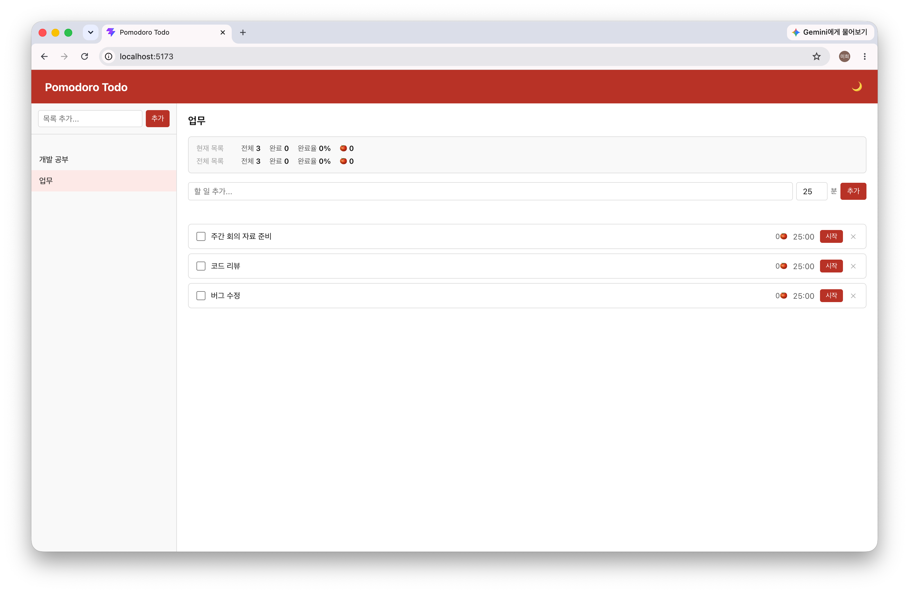
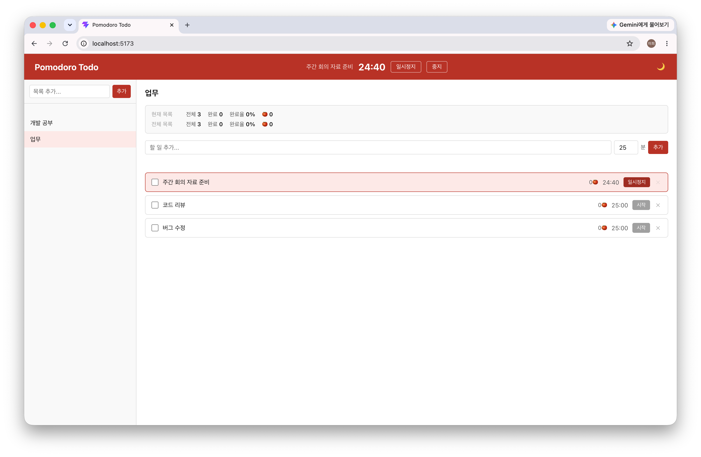
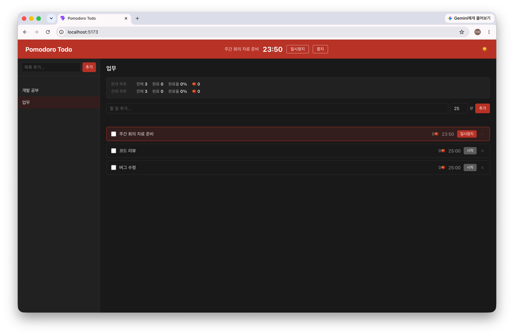
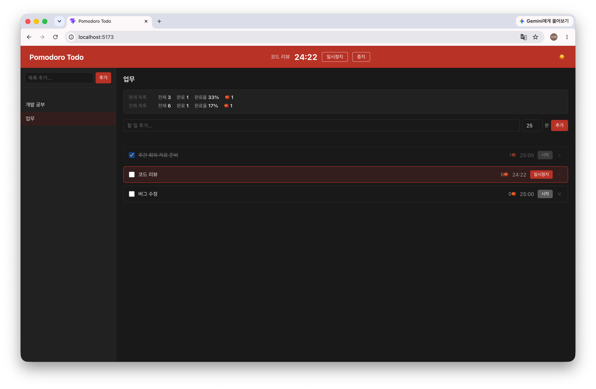

# Pomodoro Todo

할 일마다 뽀모도로 타이머를 설정하고, 집중 세션을 관리할 수 있는 투두 앱입니다.

**Demo:** [https://pomodoro-todo-vercel.vercel.app](https://pomodoro-todo-vercel.vercel.app)

## 스크린샷

| 기본 화면 | 타이머 실행 중 |
| --- | --- |
|  |  |

| 다크 테마 | 통계 |
| --- | --- |
|  |  |

## 프로젝트 배경

뽀모도로 기법을 실천하려 할 때, 타이머 앱과 할 일 앱을 번갈아 써야 하는 번거로움을 자주 느꼈습니다.

타이머와 할 일을 하나의 UI 안에서 관리하면 어떨까 하는 생각에서 시작했습니다. 할 일별로 예상 집중 시간을 설정하고, 완료된 뽀모도로 횟수를 누적해 기록하는 흐름을 구현하는 데 집중했습니다.

프레임워크 없이 Vanilla JS만으로 상태 관리와 컴포넌트 렌더링을 직접 구현하면서, 프레임워크가 제공하는 기능들의 동작 원리를 깊이 이해하는 기회가 됐습니다.

## 기술 스택

| 분류   | 사용 기술         |
| ------ | ----------------- |
| 언어   | JavaScript (ES6+) |
| 번들러 | Vite              |
| 스타일 | Vanilla CSS       |
| 데이터 | localStorage      |
| 알림   | Notification API  |

## 주요 기능

- **목록 관리** — 여러 목록을 만들어 할 일을 분류
- **할 일 관리** — 할 일별 뽀모도로 시간(1~60분) 설정
- **뽀모도로 타이머** — 시작 / 일시정지 / 재개 / 중지
- **뽀모도로 카운트** — 완료된 세션 횟수 누적 표시
- **타이머 완료 알림** — 브라우저 알림으로 세션 종료 안내 (Notification API)
- **다크 / 라이트 테마** — 헤더 토글 버튼으로 전환, 선택한 테마 localStorage에 유지
- **데이터 영구 저장** — 새로고침 후에도 데이터 유지 (localStorage)
- **드래그 앤 드롭** — 할 일 항목을 드래그해 순서 변경
- **통계** — 현재 목록 및 전체 목록의 완료율, 누적 뽀모도로 수 표시
- **유효성 검사** — 입력 폼 인라인 에러 메시지

## 기술적 의사결정

### 옵저버 패턴으로 상태 관리 직접 구현

프레임워크 없이 여러 컴포넌트가 동일한 상태를 구독하고 동기화해야 했습니다. `Store` 클래스에 `subscribe` / `setState` / `getState` 메서드를 구현해 React의 전역 상태 관리와 유사한 구조를 만들었습니다. 상태가 바뀔 때마다 등록된 리스너가 실행되어 각 컴포넌트가 스스로 리렌더링합니다.

```js
class Store {
  #state;
  #listeners = [];

  setState(updater) {
    this.#state = updater(this.#state);
    this.#listeners.forEach((fn) => fn());
  }

  subscribe(listener) {
    this.#listeners.push(listener);
    return () => {
      this.#listeners = this.#listeners.filter((fn) => fn !== listener);
    };
  }
}
```

### 타이머를 싱글턴으로 관리

타이머가 실행 중일 때 다른 목록으로 이동하면 컴포넌트가 다시 마운트됩니다. 타이머를 컴포넌트 안에서 관리하면 이 시점에 인터벌이 초기화되는 문제가 생깁니다. `PomodoroTimer` 클래스를 싱글턴으로 모듈 레벨에서 관리해, 컴포넌트 생명주기와 무관하게 타이머가 유지되도록 했습니다.

### 일시정지 시 인터벌 실제 중단

초기에는 `setInterval`을 유지한 채 `isPaused` 플래그로 틱을 건너뛰는 방식을 썼습니다. 리팩토링 과정에서 일시정지 시 `clearInterval`로 인터벌을 실제로 중단하고, 재개 시 남은 시간을 인수로 새 인터벌을 시작하는 방식으로 변경했습니다. 불필요한 플래그 검사가 사라지고 타이머 상태가 단순해졌습니다.

### localStorage 저장은 타이머 상태를 제외

새로고침 시 진행 중이던 타이머를 복원하는 것은 사용자 경험상 오히려 혼란을 줄 수 있다고 판단했습니다. `lists`와 `selectedListId`만 저장하고, 타이머 상태는 항상 초기값으로 시작합니다.

## 프로젝트 구조

```
src/
├── components/
│   ├── header/          # 헤더 (타이머 상태 표시)
│   ├── listPanel/       # 목록 패널 (목록 추가 / 선택 / 삭제)
│   └── todoPanel/       # 할 일 패널 (할 일 추가 / 타이머 제어)
├── store/
│   ├── store.js         # 옵저버 패턴 Store 클래스
│   ├── appStore.js      # 전역 상태 인스턴스 (localStorage 연동)
│   └── actions.js       # 상태 변경 액션
├── timer/
│   └── pomodoroTimer.js # 타이머 싱글턴
├── utils/
│   └── formatTime.js    # 초 → MM:SS 변환
├── styles/
│   ├── reset.css
│   └── global.css
└── main.js
```

## 시작하기

```bash
npm install
npm run dev
```

브라우저에서 [http://localhost:5173](http://localhost:5173)을 열어 확인합니다.

## 향후 계획

- [x] 타이머 종료 시 브라우저 알림 (Notification API)
- [x] 다크 / 라이트 테마 지원
- [x] 드래그 앤 드롭으로 할 일 순서 변경
- [x] 뽀모도로 통계 (완료 할 일 수, 총 집중 시간)
